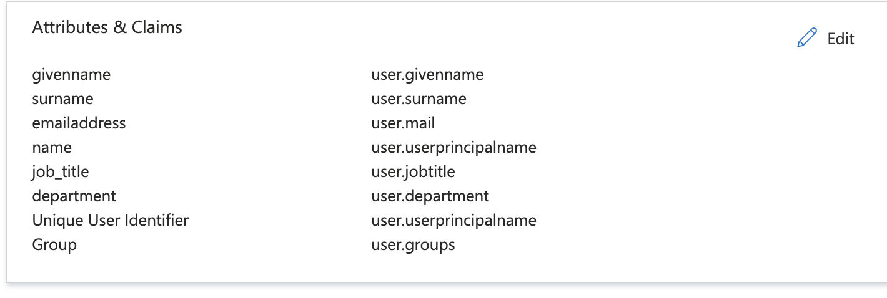

# Google Cloud Workforce Identity Federation with Azure AD 

This is the Azure AD portion of a multi project set of examples for configuring Google Cloud Workforce Identity Federation. 
- https://cloud.google.com/iam/docs/workforce-sign-in-azure-ad
- https://cloud.google.com/iam/docs/manage-workload-identity-pools-providers

## Google Disclaimer
This is not an officially supported Google product

## Prerequisites
- An existing Google Project
- An Azure AD account

## Pool Creation in Google Cloud
```bash
export PROJECT_ID=[Google Project ID]
export ORG_ID=[Google Organization ID]
gcloud services enable cloudresourcemanager.googleapis.com
gcloud services enable iam.googleapis.com
gcloud config set billing/quota_project $PROJECT_ID

gcloud iam workforce-pools create azure-workforce-pool \
--location="global"  \
--organization=$ORG_ID \
--description="Company Workforce Pool for AzureAD" \
--display-name="AzureAD Workforce Pool"
```

## Setup Azure Application
- Follow this: https://cloud.google.com/iam/docs/workforce-sign-in-azure-ad#saml
- Audience URI (SP Entity ID).: https://iam.googleapis.com/locations/global/workforcePools/azure-workforce-pool/providers/azure-workforce-provider
- Reply URL ACS URL: https://auth.cloud.google/signin-callback/locations/global/workforcePools/azure-workforce-pool/providers/azure-workforce-provider
- Relay State: https://console.cloud.google/

- Finally, download AzureWorkforceIdentity.xml




## Provider Creation in Google Cloud
You'll need the downloaded AzureWorkforceIdentity.xml file from your AzureAD application above. Additionally, the attribute mapping will be dependant on your needs.
```bash
gcloud iam workforce-pools providers update-saml azure-workforce-provider \
    --workforce-pool=azure-workforce-pool \
    --attribute-mapping="google.subject=assertion.subject,\
    attribute.job_title=assertion.attributes.job_title[0],\
    attribute.department=assertion.attributes.department[0],\
    google.groups=assertion.attributes['http://schemas.microsoft.com/ws/2008/06/identity/claims/groups'],\
    attribute.first=assertion.attributes['http://schemas.microsoft.com/ws/2008/06/identity/claims/givenname'],\
    attribute.last=assertion.attributes['http://schemas.microsoft.com/ws/2008/06/identity/claims/surname']"\
    --idp-metadata-path=./AzureWorkforceIdentity.xml \
    --location=global

#Review the configuration with the following command
#gcloud iam workforce-pools providers list --workforce-pool=azure-workforce-pool --location=global
```

## Example permissions
 To validate, I created a couple of users and a group in Azure that I had no way to sync to Google Cloud or validate the domain.
- User: test.workforceidentity@customerengineers.onmicrosoft.com
- User: test_workforce_cli@customerengineers.onmicrosoft.com
- Group: c7ff7f35-4554-47cb-bfaa-8af80a74fa83

The permissions below are examples
```bash
#Everyone can access/manage storage
gcloud projects add-iam-policy-binding $PROJECT_ID \
    --role="roles/storage.admin" \
    --member="principalSet://iam.googleapis.com/locations/global/workforcePools/azure-workforce-pool/*"

#Only one user gets access to compute
gcloud projects add-iam-policy-binding $PROJECT_ID \
    --role="roles/compute.instanceAdmin" \
    --member="principal://iam.googleapis.com/locations/global/workforcePools/azure-workforce-pool/subject/test_workforce_cli@customerengineers.onmicrosoft.com"

#Allows only DevSecOps users the BQ Data Viewer role
gcloud projects add-iam-policy-binding $PROJECT_ID \
    --role="roles/bigquery.dataViewer" \
    --member="principalSet://iam.googleapis.com/locations/global/workforcePools/azure-workforce-pool/attribute.job_title/DevSecOps"

#Allows everyone in the group access to Compute Viewer
gcloud projects add-iam-policy-binding $PROJECT_ID \
    --role="roles/compute.viewer" \
    --member="principalSet://iam.googleapis.com/locations/global/workforcePools/azure-workforce-pool/group/c7ff7f35-4554-47cb-bfaa-8af80a74fa83"
```
Based on the above, and the associated attributes and group membership in Azure, the following is true:
### Effective Permissions
test.workforceidentity@customerengineers.onmicrosoft.com
- roles/compute.viewer
- roles/storage.admin
- roles/bigquery.dataViewer

test_workforce_cli@customerengineers.onmicrosoft.com
- roles/storage.admin
- roles/compute.instanceAdmin


### Console Access
- Workforce Identity Console Access: https://console.cloud.google
- Enter: locations/global/workforcePools/[workforce_pool]/providers/[workforce_provider]
- e.g.: locations/global/workforcePools/azure-workforce-pool/providers/azure-workforce-provider


### CLI gcloud Access
```bash
#Create Login Config
gcloud iam workforce-pools create-login-config \
    locations/global/workforcePools/azure-workforce-pool/providers/azure-workforce-provider \
    --output-file=./gcloud_config_workforce.json

#Authenticate
gcloud auth login --login-config=./gcloud_config_workforce.json

#Validate
gcloud storage ls
```